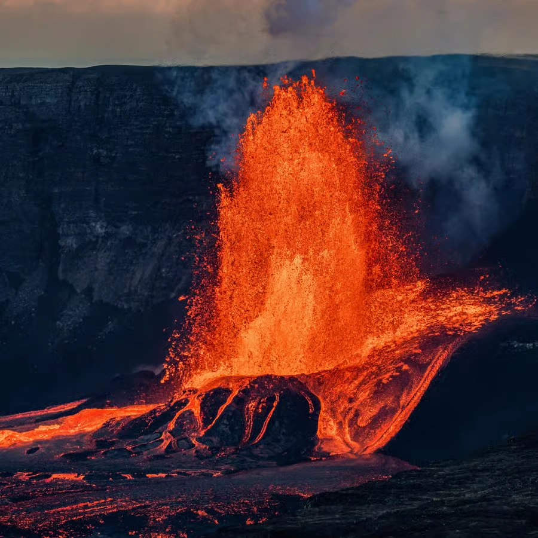

# travlr.data

Agentic environment for TRAVLR's explore section. Datasets are organized by folder to keep marker data and metadata together for the explore experience.

## Structure
- `AGENTS.md` — working instructions for maintaining the explore datasets.
- `datasets/<dataset-id>/data.json` — dataset markers or geometries.
- `datasets/<dataset-id>/description.json` — dataset metadata (`id`, `name`, `index`, `title`, `description`, `markercount`).
- `tools/` — helper scripts for dataset maintenance and asset management.

## Explore functions
Explore-ready datasets grouped by theme.

| Theme | Dataset | ID | Markers | Image | Icon | Notes |
| --- | --- | --- | --- | --- | --- | --- |
| Culture | Traditional Dishes and Origins | `traditional_food` | 800 |  | 

 | Iconic recipes mapped to the venues where they originated with confidence notes. |
| Culture | UNESCO World Heritage Sites – Human | `unesco-human` | 849 |  | 

 | Human-made heritage sites with marker confidence values. |
| Culture | World Pyramids | `pyramids` | 122 |  | 

 | Ancient through modern pyramids. |
| Culture | Alien & UFO Landmarks | `alien_world` | 15 | — | — | UFO sightings, memorials, and alien-themed landmarks rooted in enthusiast subculture. |
| Culture | Reddit Travel Locations | `reddit-travel-locations` | 26,479 |  | 

 | Crowd-sourced travel tips and places to visit. |
| Nature | UNESCO World Heritage Sites – Natural | `unesco-nature` | 203 |  | 

 | Natural heritage sites. |
| Nature | Meteorite Landings | `meteorites` | 45,716 |  | 

 | Global meteorite strike records. |
| Nature | Earthquakes | `earthquakes` | 6,107 |  | 

 | Worldwide earthquake events with magnitudes, felt reports, timestamps, and tsunami flags. |
| Nature | Iconic Waterfalls | `waterfalls` | 1,100 |  | 

 | Waterfalls with height and confidence factors. |
| Nature | Volcanoes | `vulcanoes` | 425 |  | 

 | Volcano locations with supporting details. |
| Transport | Global Airports | `airports` | 10,352 | — | — | Worldwide airports and heliports with codes, time zones, and flightability flags. |
| Transport | Global Cities | `cities` | 9,639 | — | — | City points with translations, time zones, and airport readiness flags. |
| Fiction | Lord of the Rings Filming Locations | `lotr-locations` | 131 |  | 

 | Filming locations for Peter Jackson's trilogy. |
| Fiction | Star Wars Filming & Story Locations | `star-wars-locations` | 62 |  | 

 | Filming sites and in-universe anchors. |
| Fiction | Dune Filming Locations | `dune-locations` | 106 | — | — | Real deserts, city-scale backlots, and interior soundstages explicitly shown in *Dune* (2021). |
| Fiction | Harry Potter Filming Locations | `harry-potter-locations` | 74 |  | 

 | Locations used across the film series. |
| Fiction | Game of Thrones Filming Locations | `game-of-thrones-locations` | 300 |  | 

 | Filming sites with confidence scores. |
| Fiction | The Last of Us Filming Locations | `last-of-us-locations` | 100 | — | — | Alberta filming sites for the HBO series with per-location notes. |
| Fiction | Breaking Bad Filming Locations | `breaking-bad-locations` | 222 | — | — | Albuquerque and New Mexico shoots with per-location notes. |
| Fiction | James Bond Filming & Story Locations | `james-bond-locations` | 62 |  | 

 | Mix of filming sites and in-universe anchors with confidence factors. |
| Fiction | Pirates of the Caribbean Ports & Coastlines | `pirates-caribbean-coasts` | 108 | — | — | Real-world ports, islands, and coastal vistas seen across the film series. |
| Fiction | Indiana Jones Filming Locations | `indiana-jones-locations` | 58 | — | — | Key filming locations spanning the adventure series. |
| Fiction | Assassin's Creed Real-World Locations | `assassins-creed-locations` | 263 |  | 

 | Historical sites and analogs from the franchise. |
| Fiction | Fallout Explorable Locations | `fallout-explore` | 350 |  | 

 | Fallout locales mapped to real-world coordinates with confidence ratings. |

## Polygon sets
Boundary and region geometries for polygon-based exploration.

| Dataset | ID/Source | Features | Notes |
| --- | --- | --- | --- |
| Ancient Empires Peak Extents | `ancient-empires` | 14 | MultiPolygon outlines for major empires at their peak reach. |
| Country and US Bounding Boxes | `country-bounds` | 254 | Bounding boxes for global countries and U.S. regions. |
| Indigenous & Community Conserved Areas | `indigenous_people` | 24 | ICCA Registry polygons highlighting Indigenous and community stewarded territories. |
| United States Feature Collection | `us-states` | 52 | U.S. state and territory polygons. |
| Time Zones | `time-zones` | Shapefile | Natural Earth 1:10m time zone polygons (feature count depends on importer). |
| Tectonic Plates | `tectonic-plates` | 54 | PB2002 tectonic plate boundaries in GeoJSON format. |

## Adding a dataset
1. Create `datasets/<dataset-id>/` and place the source JSON in `data.json` without altering its structure unless necessary.
2. Add a `description.json` with the required metadata fields and updated `markercount`.
3. Update this README to include the new dataset summary.

## Tools
- `tools/download_images.py` — download images from an `images.txt` manifest. Use `--dataset <id>` to drop images into `datasets/<id>/assets/images` (or override with `--out`). The script commits changes by default and only pushes when `--push` is provided. Requires the `requests` package.

## Coming Soon: New Explore Datasets

These upcoming Explore datasets expand TRAVLR beyond classic points of interest, focusing on **context, scale, and human stories**. Each dataset is designed to support curiosity-driven exploration and long-term memory building, rather than checklist tourism.

---

### 🌍 Unique Geological Formations

**Dataset ID:** `unique-geology`

This dataset highlights rare and visually striking geological phenomena that reveal how the planet was formed.

**Core Concept:**
Explore places shaped by deep time and extreme natural processes — formations that exist nowhere else or only in a handful of locations worldwide.

**Includes:**

* Columnar basalt formations
* Salt flats and evaporite basins
* Sinkholes and karst systems
* Stone forests and eroded rock cities

**Why it matters:**
These locations invite awe and curiosity, offering a tangible connection to Earth’s geological history and reinforcing TRAVLR’s focus on meaningful exploration.

---

### 🧭 Extreme Geography Points

**Dataset ID:** `geographic-extremes`

This dataset maps the physical limits of human habitation and natural conditions.

**Core Concept:**
Discover where life persists under extreme environmental conditions — the edges of what is geographically possible.

**Includes:**

* Highest permanently inhabited villages
* Driest places on Earth
* Coldest inhabited towns
* Remote and isolated settlements

**Why it matters:**
Extreme geography reframes travel as a story of adaptation and resilience, adding depth to how places are understood and remembered.

---

## 🕰️ History

A new Explore pillar focused on **movement, power, and modern memory** — showing how human decisions and events shaped the world map over time.

---

### 🧳 Famous Journeys & Expeditions

**Dataset ID:** `historic-expeditions`

This dataset traces the routes of history’s most influential journeys.

**Core Concept:**
Follow the paths of explorers, scientists, and adventurers whose travels changed global understanding.

**Includes:**

* Marco Polo’s trade routes
* Magellan’s circumnavigation
* Darwin’s voyage on the HMS Beagle
* Polar expeditions (e.g. Shackleton)

**Why it matters:**
Travel becomes narrative-driven, allowing users to explore movement through space and time rather than static locations.

---

### 🏛️ Rise & Fall of Empires (Capital Layers)

**Dataset ID:** `historic-capitals`

This dataset visualizes political power through shifting capitals across history.

**Core Concept:**
See how centers of power emerge, move, and disappear as empires rise and fall.

**Includes:**

* Ancient and medieval capitals
* Successive capitals within the same empire
* Temporal layers showing change over centuries

**Why it matters:**
It transforms the map into a historical timeline, helping users understand geopolitical evolution at a glance.

---

### 🧱 Cold War & Modern History Sites

**Dataset ID:** `cold-war-sites`

This dataset focuses on recent history that still shapes today’s world.

**Core Concept:**
Explore physical remnants of 20th-century geopolitics and global tension.

**Includes:**

* Berlin Wall remnants
* Missile silos and launch sites
* Bunkers, borders, and surveillance infrastructure

**Why it matters:**
These sites connect personal memory, collective history, and modern identity — aligning strongly with TRAVLR’s Memory Ecosystem vision.

---

**Status:** Coming Soon

These datasets will be progressively introduced into Explore Mode, expanding TRAVLR’s map from a collection of places into a living, layered memory system.
